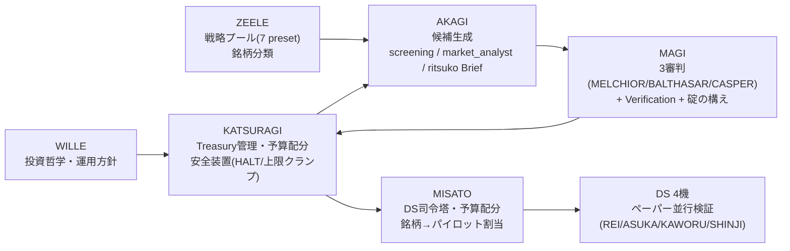
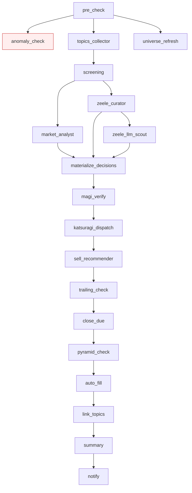
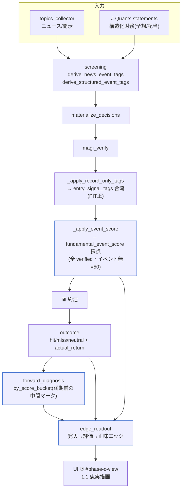
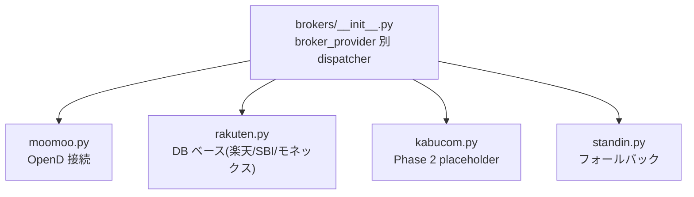

# INVESTIGELION アーキテクチャ図（実コード準拠・ver 管理）

> **version: v1**（2026-06-06 / master 起稿）
> **目的**: ユーザー（CD）が全体パイプラインを一目で検証できるようにする。
> **正本ポリシー**: このファイルは実コードから導出する。コードと食い違ったら**コードが正**。
> 変更時は version を bump し、末尾の更新履歴に1行追記する。
> **owner**: UI（可視化担当）。初版は throttle 中の UI 代行で master が起稿。以後 UI が refine。

---

## 1. ゾーン構成（誰が何を担うか）

エヴァンゲリオン命名で6ゾーンが役割分担。

| ゾーン | 役割 | 主な実装 |
|---|---|---|
| WILLE | 投資哲学・運用方針（中期で負けない→利益を積む） | `trading_agent/wille/` |
| KATSURAGI | Treasury・予算配分・安全装置（HALT/上限クランプ）。WILLE ゾーンのオーケストレーター | `trading_agent/portfolio/`・`katsuragi_dispatch` |
| ZEELE | 戦略プール（7 preset で銘柄分類） | `trading_agent/screening/`（zeele_curator） |
| AKAGI | 候補生成（screening / market_analyst / ritsuko Brief） | `trading_agent/screening/`・`trading_agent/wille/ritsuko.py` |
| MAGI | 3審判＋Verification（判定・碇の構え） | `trading_agent/magi/` |
| MISATO | DS の司令塔（予算配分・銘柄→パイロット割当・昇格判定） | `scripts/misato_dispatch.py` |
| DS 4機 | ペーパー並行検証（本番稼働対象・将来自動決済） | DS パイロット |

---

## 2. 朝バッチ DAG（19 ノード・実コード準拠）

毎日 07:00 JST に launchd で自動実行。`trading_agent/orchestrator/morning_batch.py:903-987` の `nodes` 定義が正本。
`DAGExecutor` が `depends_on` に従い、依存の無いノードを並列実行する。

| # | ノード | 依存 | 役割 |
|---|---|---|---|
| 1 | pre_check | — | 前処理・stale awaiting の繰越 cancel |
| 2 | anomaly_check | pre_check | 異常検知＋HALT（auto モードのみ発火）※安全装置・下流なし |
| 3 | topics_collector | pre_check | ニュース/開示トピック収集 |
| 4 | universe_refresh | pre_check | Universe 更新（並列ブランチ） |
| 5 | screening | topics_collector | 候補スクリーニング＋シグナルタグ導出 |
| 6 | zeele_curator | screening | ZEELE 7戦略への分類（決定論） |
| 7 | zeele_llm_scout | zeele_curator | screening 漏れを Haiku で発掘（BudgetGuard 日次¥10/月¥200） |
| 8 | market_analyst | screening | news_sentiment_score 供給（朝バッチ既定は決定論化＝¥0） |
| 9 | materialize_decisions | market_analyst, zeele_curator, zeele_llm_scout | 候補→Decision 実体化 |
| 10 | magi_verify | materialize_decisions | 3審判検証＋タグ合流＋(c)スコア採点（記録のみ） |
| 11 | katsuragi_dispatch | magi_verify | 候補プール統合（AKAGI Brief+DS+priority+opportunity fill） |
| 12 | sell_recommender | katsuragi_dispatch | 売却推奨 |
| 13 | trailing_check | sell_recommender | トレーリング・決算前 stop 厳格化（G-2） |
| 14 | close_due | trailing_check | 期限到来 sell Decision を即 close |
| 15 | pyramid_check | close_due | ピラミッディング判定 |
| 16 | auto_fill | pyramid_check | auto モードで approved Decision を即 fill |
| 17 | link_topics | auto_fill | Decision とトピックの紐付け |
| 18 | summary | link_topics | サマリ生成 |
| 19 | notify | summary | 発注リスト HTML 生成（＋paper auto fill シミュレーション） |

> 注: 新規 buy 候補は `materialize → magi_verify → katsuragi_dispatch` 経由で **status="awaiting"** のまま手動決済待ち（楽天 API 無しのため `automation_mode="manual"`）。`auto_fill` が即 fill するのは trailing/pyramid が登録した `approved` のみ。

---

## 3. ニュース/ファンダ → 利益 測定チェーン（mission の本線）

「ニュース・ファンダ情報を判断に接続し、勝ちエッジを前向きに測定する」中核経路。
**全段 record-only（売買・gate を一切変えない）**。下図は master が 2026-06-06 にコード+DB で配線検証した実体。

### 段ごとの実体（コード参照）

| 段 | 関数 / 場所 | 入力 → 出力 |
|---|---|---|
| タグ導出 | `screening/turnaround.py` `derive_structured_event_tags` / `news_keywords.py` | 財務/news → `event_upward_revision` 等のタグ |
| タグ合流 | `magi/persist.py:217-222` `_apply_record_only_tags` | タグ → `Decision.entry_signal_tags`（PIT正・backfillなし） |
| 採点 | `magi/persist.py:230` `_apply_event_score` → `screening/event_score.py` `compute_fundamental_event_score` | タグ → `fundamental_event_score`(0-100, 50中立) |
| バケット | `screening/event_score.py:63` `bucket_event_score` | score → low/mid/high/unscored（version ロック・誤バケットなし） |
| 前向き診断 | `reporting/forward_diagnosis.py` `by_score_bucket` | 評価済 → bucket×horizon(5/20/40/60d) 成績 |
| エッジ集計 | `scripts/phase_c_status.py:359` `_edge_readout` | 発火→評価→正味エッジを1ビュー統合 |
| 可視化 | UI `#phase-c-view` ⑦ブロック | `snapshot['edge_readout']` を忠実描画 |

### スコア式（event_score_v1・version ロック）

| タグ | 重み | 種別 |
|---|---|---|
| event_upward_revision / downward | ±25 | 構造化（J-Quants・低ノイズ） |
| event_dividend_hike / cut | ±15 | 構造化 |
| earnings_accel | +15 | 構造化 |
| news_positive / negative | ±8 | news 見出し（弱・単独では tail に届かない） |

cut point: low≤40 / mid 40-60 / high≥60（50中立帯）。**式・cut を変えたら version bump**（観測後の後出し調整=p-hacking を防ぐ）。

### small-n ガード（欺瞞防止）

評価済 n で status を明示し、UI は判定を持たずフラグを忠実描画する：

| 評価済 n | status | display_only | 意味 |
|---|---|---|---|
| < 30 | insufficient | True | 表示のみ・売買判断に使わない |
| 30–99 | exploratory | True | 探索的・売買判断に使わない |
| ≥ 100 | candidate | False | 候補（さらに期間分割の符号安定が前提） |

---

## 4. broker 構造（拡張可能 dispatcher）

- 現状: `broker_mode="paper"`（試験運用）/ `broker_provider="rakuten"` / `automation_mode="manual"`。
- 将来の自動売買接続は対応 broker クラスを実装し dispatcher に1ブロック追加するだけ。

---

## 5. forward runner（前向き測定の起動）

- 既定 **OFF**（構築期間中の自動 yfinance 実行を防ぐ）。
- 起動: `Setting forward_diagnosis_enabled=true`（DB 書き換え＝ユーザー承認必須）＋ launchd plist load。手動実行は `scripts/forward_diagnosis.py --force`。
- 起動は**測定の時計を回し始める行為**。エッジが埋まるのは保有が満期(5/20/40/60d)を迎え評価が確定していくにつれて（現状 評価済 outcome は希少＝出力は unscored 中心が正常）。

---

## 更新履歴

| version | 日付 | 変更 | 担当 |
|---|---|---|---|
| v1 | 2026-06-06 | 初版。6ゾーン＋19ノード DAG＋news→利益チェーン＋broker＋forward runner を実コードから起稿 | master（UI 代行） |
